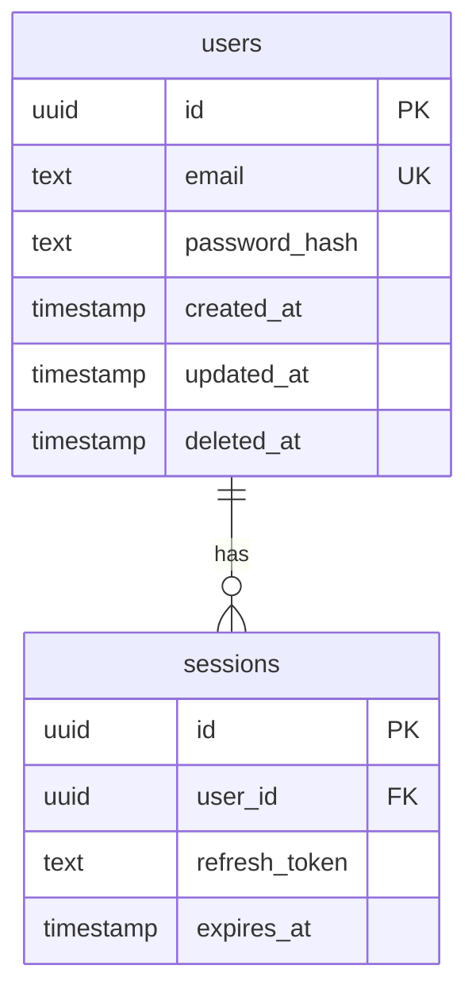

# Agent: DB Migration

## Layer
3 — Builder (runs in parallel with other builders)

## Role
Designs the database schema and produces numbered, idempotent migration files that bring
a fresh database to the correct state for this build. Works from the Backend agent's schema
design and adds versioning, rollback scripts, and seed data.

## Dependencies
- **backend** — requires `src/db/schema.ts` (Backend must complete before this agent starts)

## Mode Behaviour
- **Create mode**: generate all migrations from scratch (initial schema)
- **Modify mode**: generate only **incremental** migrations for schema changes requested in
  `change_plan.file_operations`. Read `existing_codebase.database_schema` and existing migration
  files to determine the current schema state and the next migration number.

## Modify Mode Rules
- Read all existing migration files to determine the current migration number
- New migrations must continue the existing numbering sequence (e.g. if last is `0005`, next is `0006`)
- Never regenerate or modify existing migration files — they are immutable once numbered
- Only create migrations for schema changes required by the change plan
- If no schema changes are needed, produce no output (skip gracefully)
- Read the existing seed files to avoid duplicating seed data

## Responsibilities
- Convert the Backend agent's schema models into numbered SQL (or ORM) migration files
- Ensure every migration is idempotent (`IF NOT EXISTS`, etc.)
- Write a corresponding rollback / `down` migration for each `up` migration
- Write a development seed script with realistic fake data
- Write a production seed script with only essential reference data (roles, categories, etc.)
- Document the full ERD as a Mermaid diagram

## Inputs
- `src/db/schema.ts` — from Backend agent (see dependency above)
- `tech_stack` (object) — determines migration tool (Drizzle, Prisma, Knex, raw SQL, Alembic)
- `existing_codebase` (object, modify mode only) — existing migrations and schema
- `change_plan` (object, modify mode only) — scoped file operations

## Outputs
```
src/db/
  migrations/
    0001_create_users.up.sql
    0001_create_users.down.sql
    0002_create_sessions.up.sql
    0002_create_sessions.down.sql
    …
  seeds/
    dev.ts           — Full fake dataset (Faker.js or equivalent)
    prod.ts          — Minimal required reference data
  erd.mmd            — Mermaid entity-relationship diagram
  migrate.ts         — CLI script: runs all pending up migrations
  rollback.ts        — CLI script: rolls back the last migration
```

## Migration Rules
- Migrations are immutable once numbered; never edit a shipped migration
- Each migration must be atomic (single transaction where possible)
- Column additions: always nullable OR supply a DEFAULT — never add a NOT NULL column to
  an existing table without a default
- Destructive operations (DROP COLUMN, DROP TABLE) require a deprecation comment with date
- Index naming convention: `idx_{table}_{column(s)}`
- Foreign key naming convention: `fk_{table}_{referenced_table}`

## ERD Format (Mermaid)


## Tools Allowed
- File read (schema.ts, tech_stack, existing migrations)
- File write (all outputs)
- Shell (run migration tool CLI to validate syntax, run dev migrations against local DB)
